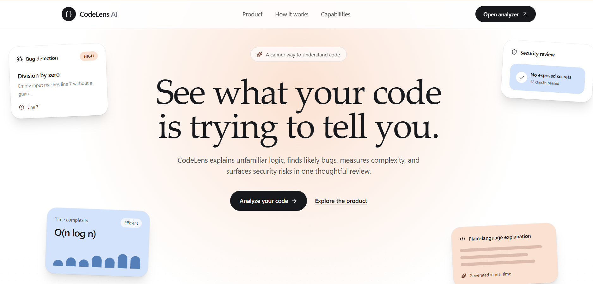
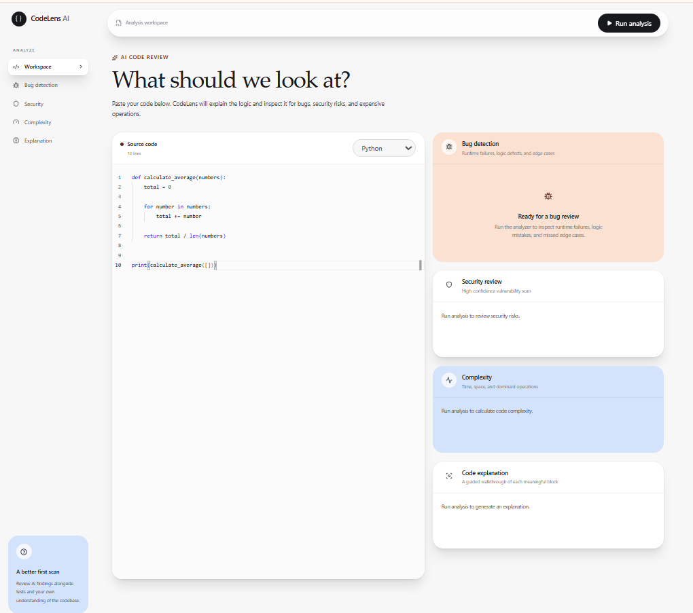
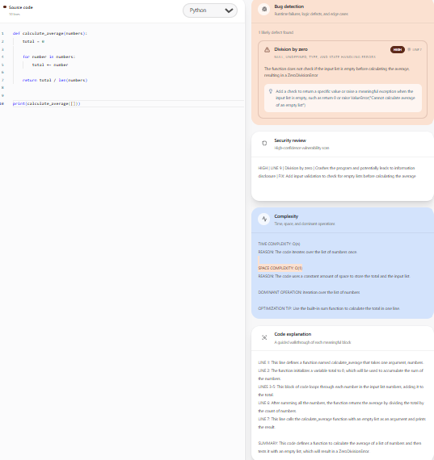

# 🚀 CodeLens AI

AI-powered code intelligence platform that helps developers understand, debug, secure, and optimize source code in real time.

<p align="center">
  
  
  
  
  
</p>

---

## 📌 Overview

CodeLens AI is an AI-powered code review platform that analyzes source code and provides four parallel reviews:

* 🐞 Bug Detection
* 🛡️ Security Analysis
* ⚡ Complexity Analysis
* 🧠 Code Explanation

The platform streams results in real time using FastAPI Server-Sent Events (SSE) and Groq LLM inference.

---

## 📸 Screenshots

### Landing Page



### Analyzer Dashboard



### Analysis Results



---

## ✨ Features

### 🐞 Bug Detection

* Runtime error detection
* Logical bug identification
* Edge case discovery
* Unsafe operation analysis

### 🛡️ Security Analysis

* SQL Injection detection
* Unsafe execution detection
* Input validation checks
* Security risk identification

### ⚡ Complexity Analysis

* Time Complexity
* Space Complexity
* Dominant Operation Analysis
* Optimization Suggestions

### 🧠 Code Explanation

* Line-by-line explanations
* Code summaries
* Developer-friendly insights

### 🌐 Multi-Language Support

* Python
* Java
* JavaScript
* TypeScript
* C++
* C#
* Go
* Rust
* SQL

---

## 🏗️ Tech Stack

| Layer     | Technology                |
| --------- | ------------------------- |
| Frontend  | React, Vite, Tailwind CSS |
| Editor    | Monaco Editor             |
| Backend   | FastAPI                   |
| AI        | Groq API                  |
| Model     | Llama 3.3 70B Versatile   |
| Streaming | Server-Sent Events (SSE)  |
| Animation | Framer Motion             |

---

## 📂 Project Structure

```text
codelens-ai/
├── backend/
│   ├── analyzer.py
│   ├── prompts.py
│   ├── main.py
│   └── requirements.txt
│
├── frontend/
│   ├── src/
│   │   ├── components/
│   │   ├── pages/
│   │   ├── App.jsx
│   │   └── main.jsx
│   └── package.json
│
├── docs/
│   └── screenshots/
│
└── README.md
```

## ⚙️ Installation

### Backend Setup

```bash
cd backend

python -m venv venv

venv\Scripts\activate

pip install -r requirements.txt
```

Create `.env`

```env
GROQ_API_KEY=YOUR_GROQ_API_KEY
```

Run Backend

```bash
uvicorn main:app --reload
```

---

### Frontend Setup

```bash
cd frontend

npm install

npm run dev
```

---

## 🚀 Future Improvements

* Unit Test Generation
* Refactoring Suggestions
* PDF Export Reports
* GitHub Repository Analysis
* Pull Request Review
* AI Chat Assistant

---

## 👩‍💻 Author

**Deekshitha K V**

Computer Science Engineering

GitHub: https://github.com/Deekshithakv

---

⭐ If you found this project useful, consider giving it a star.
